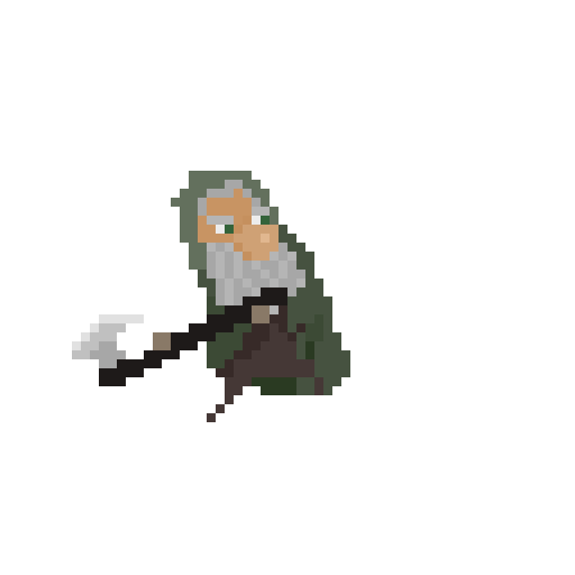

# Woodblight

 

Woodblight is a game about a forest gnome.

With an axe.

And a mission.

Made for the Godot Wild Jam 77.

## Attributions

Credit where credit is due!

### Quaver font

A free teeny-tny pixel font by Nathan Scott.
https://caffinate.itch.io/quaver 

License: (Creative Commons Zero, CC0)
https://creativecommons.org/publicdomain/zero/1.0/

### Godot SplashScreens

Alternate pixelated splash screen by KenneyNL.
https://github.com/KenneyNL/Godot-SplashScreens

License: (Creative Commons Zero, CC0)
http://creativecommons.org/publicdomain/zero/1.0/

The original Godot logo is made by Andrea Calabró and is [CC-BY-4.0](https://github.com/godotengine/godot/blob/master/LOGO_LICENSE.txt) licensed.

### Input Prompts Pixel 16x

Glyphs for various input prompts, by KenneyNL.
https://kenney.nl/assets/input-prompts-pixel-16

License: (Creative Commons Zero, CC0)
http://creativecommons.org/publicdomain/zero/1.0

## Acknowledgements

🐣 Game template generated from a 🐤 Chickensoft Template — <https://chickensoft.games>.

What a lovely way to work with Godot in C#!

